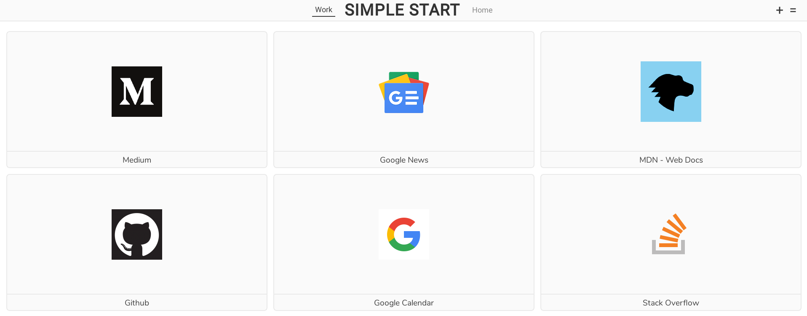

# Simple Start

<b>

One thing I disliked about Firefox after I switched from Opera to it, was lack of speed dial for new tab page. That's why I created Simple Start - for minimalistic new tab page speed dial.

</b>

  

## License:
Simple Start extension is open-source project licensed under the [GLP-3.0 license](LICENSE).
