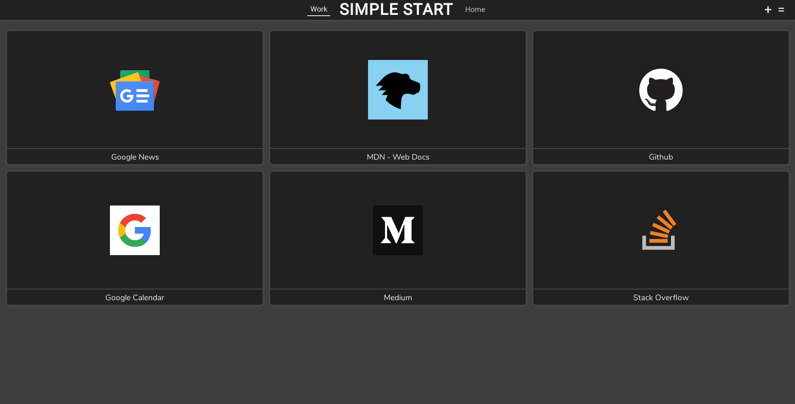
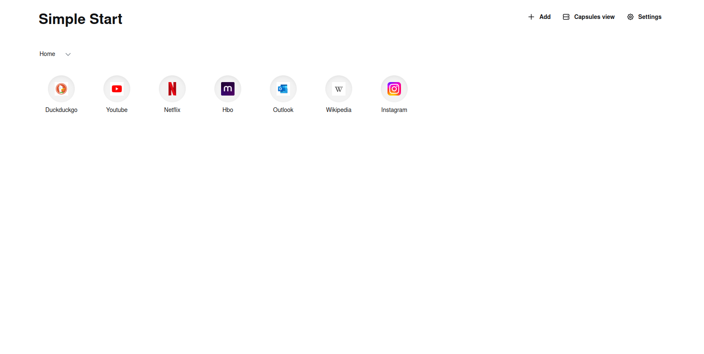

# Simple Start
I've created this extension as I always felt that other browsers had better new tab views than Firefox. I wanted to have a simple and minimalistic new tab view that would allow me to organize my bookmarks into categories. 
This is something that I use daily across different devices so there's no reason to be worried that this extension will no longer be supported and it's still highly updated.

<table align="center">
	<tr>
		<td></td>
		<td></td>
	</tr>
	<tr align="center">
		<td>first version</td>
		<td>first and latest redesign</td>
	</tr>
</table>

## 🔑 Key features: 
* Organize bookmarks into categories
* Add any website as a bookmark
* Synchronization between devices
* Different built-in themes (light and dark) and with option to create custom ones
* Very customizable
* Minimalistic 
* Open-source 
* Completely free to use

## 🤝 Contribution:
I strongly encourage to contribute to development of Simple Start extension. Bugs reports and new features suggestions can be made by creating a new issue - with appropriate title and description please.

**To test it locally, you need to follow this steps:**
* Make sure you have `yarn` installed on your machine.
* Run `yarn install` in the root of the extension.
* To start in development mode (with watcher aka "auto-refresh"), run `yarn dev` in the root of the extension.
  * When developing for Chrome you need to run `BROWSER=chrome yarn dev` instead.
* Add the extension to your Firefox, by going to `about:debugging` page, `This Firefox` tab and loading *Simple Start* as a temporary add-on by choosing the `dist/manifest.json` file. 

* Run `yarn build` to create a "production" build or `BROWSER=chrome yarn build` for Chrome. Keep in mind that it may be required to delete the `dist` folder before running the build command for a different browser.

## 📦 Favicon Service
Simple Start uses [Besticon](https://github.com/mat/besticon) to provide users with correct icons for each and every website. It's an open-source favicon service, written in Go.
It's hosted on [Fly.io](https://fly.io/) from docker image, and with both the Prometheus metrics and the HTML pages disabled via the environment variables so no metrics are collected.

## 📝 License:
Simple Start extension is open-source project licensed under the [GLP-3.0 license](LICENSE).
