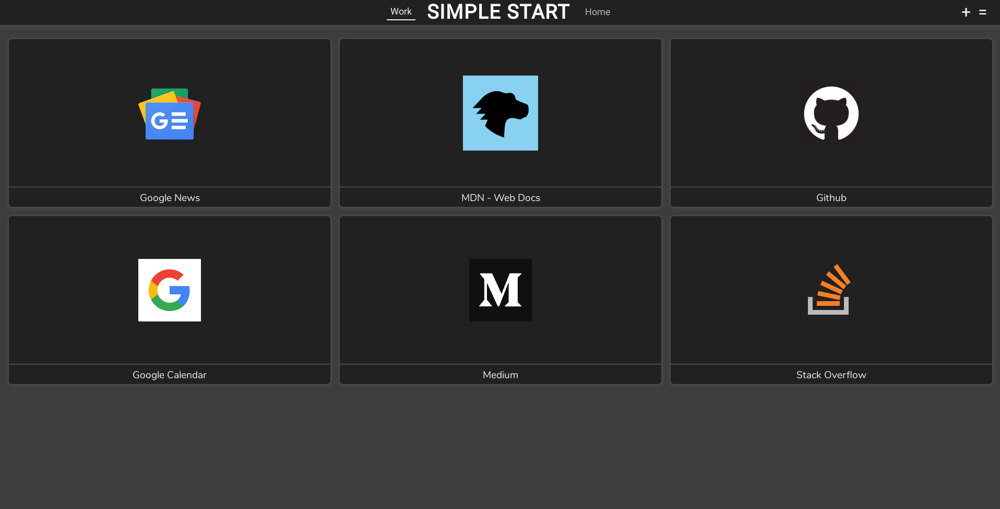

# Simple Start

One thing I disliked about Firefox after I switched from Opera to it, was lack of speed dial for new tab page. That's why I created Simple Start - for minimalistic new tab page speed dial.

	<a href="https://simplestart.mtymon.me/">Homepage</a>
	|
	<a href="https://addons.mozilla.org/en-US/firefox/addon/simple-start/">Get it for Firefox</a>

	

## 🔑 Key features: 
* Organize bookmarks into groups.
* Save any website.
* Synchronization between devices.
* Built-in dark mode.
* Customizable.
* Minimalistic.
* Open-source.
* Completely free to use.

## 🤝 Contribution:
I strongly encourage to contribute to development of Simple Start extension. Bugs reports and new features suggestions can be made by creating new Issue - with appropriate title and description.

## 📦 Favicon Service
Simple Start use [Besticon](https://github.com/mat/besticon) to gain ability to show websites favicon. Hosted on Heroku.

## 📝 License:
Simple Start extension is open-source project licensed under the [GLP-3.0 license](LICENSE).
